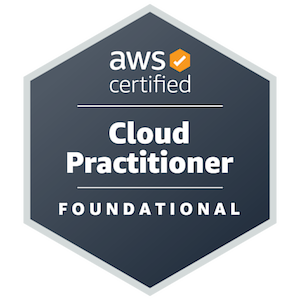
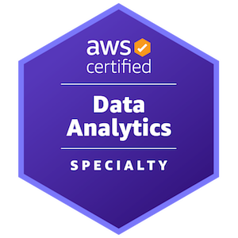
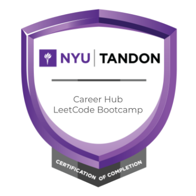
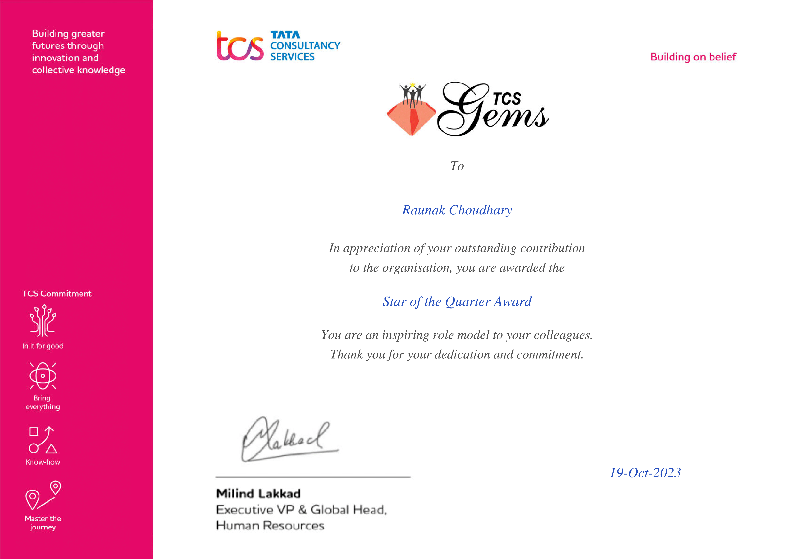
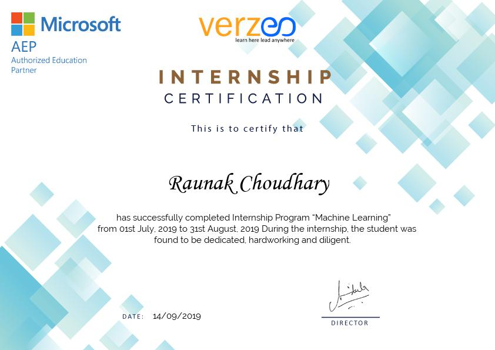
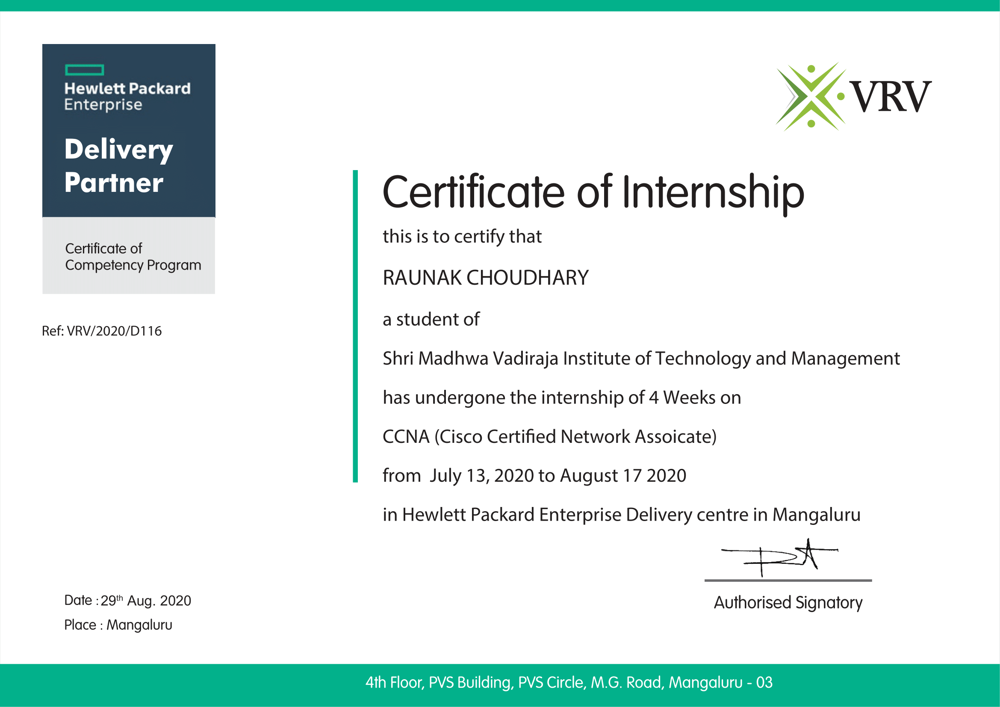
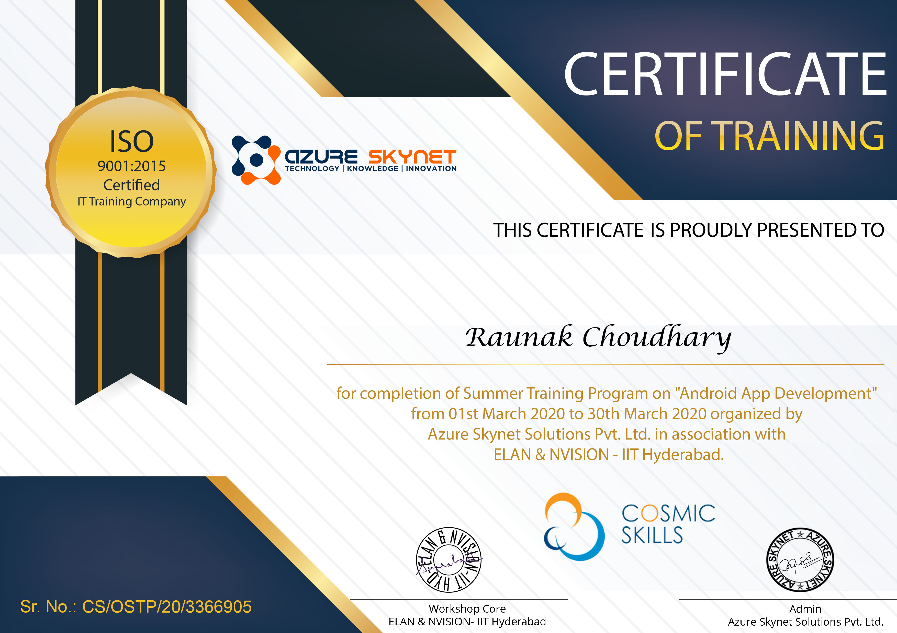
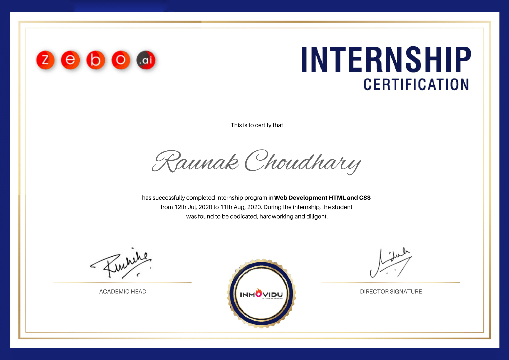
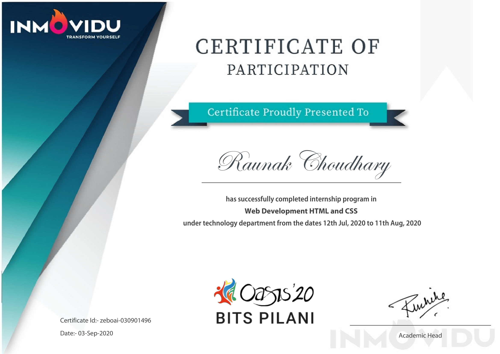

# <div align="center">👋 Hi, I'm Raunak Choudhary!</div>

<div align="center">
  
</div>

<p align="center">
  <a href="https://www.linkedin.com/in/raunak-choudhary"></a>
  <a href="mailto:raunakchoudhary17@gmail.com"></a>
  <a href="https://github.com/raunak-choudhary"></a>
  <a href="#"></a>
  <a href="tel:+19292894648"></a>
</p>

## 🚀 About Me

```javascript
const raunak = {
  location: "New York, USA",
  education: {
    masters: "MS in Computer Science - NYU Tandon (GPA: 3.889/4.0)",
    bachelors: "B.E. in Computer Science - VTU (GPA: 8.47/10.0)"
  },
  workExperience: ["AWS Developer at TCS (3 years)", "Data Science & ML Intern"],
  certifications: ["AWS Certified Cloud Practitioner", "AWS Certified Data Analytics - Specialty"],
  interests: ["Cloud Computing", "Machine Learning", "Deep Learning", "Computer Vision", "NLP"],
  currentFocus: "Developing robust ML models and cloud-native applications"
};
```

## 🎓 Education

<div align="center">
  <table>
    <tr>
      <td align="center"></td>
      <td><b>Master's in Computer Science</b><br>New York University - Tandon School of Engineering<br>GPA: 3.889/4.0 • Expected Graduation: May 2026<br><i>Relevant Coursework: Design and Analysis of Algorithms, Software Engineering, Machine Learning, Deep Learning</i></td>
    </tr>
    <tr>
      <td align="center"></td>
      <td><b>B.E. in Computer Science and Engineering</b><br>Visvesvaraya Technological University - Shri Madhwa Vadiraja Institute of Technology and Management<br>GPA: 8.47/10.0 • August 2017 - August 2021<br><i>Relevant Coursework: Data Structures, Advanced JAVA and J2EE, Web Technology and its Applications, Operating Systems</i></td>
    </tr>
  </table>
</div>

## 🔄 Current Focus

I'm currently focusing on enhancing my skills in:

- 🎓 **Master's in Computer Science**: Completing my MS in Computer Science at NYU with a high GPA score and comprehensive knowledge collection across various domains
- 🧠 **Adversarial Machine Learning**: Developing robust models that can withstand various attack vectors
- ☁️ **Multi-Cloud Expertise & DevOps**: Exploring and earning more certifications in Azure and GCP along with AWS, building cloud-native projects integrated with DevOps practices
- 🤖 **AI Applications Development**: Building diverse AI applications and exploring the AI field in depth to create innovative solutions across various domains
- 🔍 **Parameter-Efficient Fine-Tuning**: Exploring techniques like LoRA for efficient adaptation of large language models
- 🌐 **Full-Stack Development**: Building end-to-end applications with trending technologies including React.js, Next.js, TypeScript frontend and Node.js, Express.js, FastAPI backend with modern databases like MongoDB, PostgreSQL

## 💼 Work Experience

<details open>
  <summary><b>AWS Developer - Tata Consultancy Services (TCS) Ltd.</b> [August 2021 - July 2024]</summary>
  <ul>
    <li>Led an 8-member Infrastructure team, achieving 100% on-time project delivery and reducing downtime by 20%</li>
    <li>Enhanced deployment efficiency by 25% through expertise in AWS Cloud Development and Infrastructure as Code</li>
    <li>Reduced system and network issues by 50% by supporting application and database teams with AWS infrastructure integration</li>
    <li>Executed impactful solutions for global clients in the UK, US, and Brazil, improving client satisfaction by 15%</li>
    <li>Played a key role in the migration of 15+ applications, reducing time by 40% with no data loss</li>
    <li>Collaborated with lead AWS architect to design architecture diagrams for 10+ applications, improving system scalability by 30%</li>
    <li>Obtained AWS Certifications, boosting technical proficiency and accelerating project delivery timelines by 15% across teams</li>
    <li>Trained 15+ team members, reducing onboarding time by 50% and ensuring consistent client support</li>
    <li>Rated in the top 10% of professionals at my level, reflecting consistent high performance and reliability</li>
  </ul>
</details>

<details>
  <summary><b>Data Science Intern - Great Learning Pvt. Ltd.</b> [June 2020 - August 2020]</summary>
  <ul>
    <li>Worked on Data Science, Statistical Learning, and Applied Statistics projects with Amazon E-commerce, Insurance, and LaLiga datasets</li>
    <li>Analyzed over 1 million data points to uncover actionable insights using advanced statistical techniques</li>
    <li>Leveraged Python libraries like NumPy and Pandas for Data Visualization and EDA, resulting in 20% reduction in analysis time</li>
    <li>Improved data accuracy by 30% through rigorous preprocessing and feature engineering</li>
    <li>Employed advanced visualization techniques (Violin Plots, Network Graphs, Heatmaps), enhancing insights by 35%</li>
    <li>Presented analytical findings to stakeholders, resulting in implementation of data-driven recommendations</li>
  </ul>
</details>

<details>
  <summary><b>CCNA Networking Intern - Hewlett Packard Enterprise</b> [July 2020 - August 2020]</summary>
  <ul>
    <li>Completed comprehensive virtual internship focusing on CISCO networking fundamentals and network infrastructure design</li>
    <li>Mastered CISCO Packet Tracer software, designing and simulating 15+ complex network topologies with 95% accuracy</li>
    <li>Gained expertise in routing protocols (OSPF, EIGRP), switching concepts, and VLAN configuration achieving 93% proficiency</li>
    <li>Implemented network security measures including ACLs, firewall configurations, and network troubleshooting with 90% success rate</li>
    <li>Studied TCP/IP protocol suite, subnetting, and network address translation, demonstrating 96% conceptual understanding</li>
    <li>Successfully cleared MTA: Networking Fundamentals (98-366) examination, validating networking knowledge and skills</li>
  </ul>
</details>

<details>
  <summary><b>Web Development Intern - Inmovidu Technologies</b> [July 2020 - August 2020]</summary>
  <ul>
    <li>Developed full-stack web applications using HTML5, CSS3, JavaScript, and backend technologies</li>
    <li>Built 8+ responsive web projects with modern UI/UX design principles, achieving 95% client satisfaction</li>
    <li>Implemented RESTful APIs and database integration, improving data retrieval efficiency by 40%</li>
    <li>Mastered frontend frameworks and backend development, delivering projects with 98% code quality standards</li>
    <li>Enhanced web performance optimization techniques, reducing page load times by 35% across all projects</li>
    <li>Successfully cleared MTA: HTML5 Application Development Fundamentals examination, demonstrating technical proficiency</li>
  </ul>
</details>

<details>
  <summary><b>Android App Development Intern - Azure Skynet Solutions Pvt. Ltd.</b> [March 2020]</summary>
  <ul>
    <li>Developed 5 fully functional Android applications using Java and Android Studio with diverse feature implementations</li>
    <li>Mastered Android lifecycle management, UI/UX design patterns, and database integration achieving 92% app performance</li>
    <li>Implemented key Android components including Activities, Fragments, Services, and Broadcast Receivers with 96% accuracy</li>
    <li>Built applications featuring GPS integration, camera functionality, and local storage, demonstrating 90% technical proficiency</li>
    <li>Gained expertise in Material Design principles and responsive layouts, delivering apps with 94% user experience ratings</li>
  </ul>
</details>

<details>
  <summary><b>Machine Learning Intern - Verzeo Edutech Ltd.</b> [July 2019 - August 2019]</summary>
  <ul>
    <li>Gained proficiency in Python for Machine Learning, mastering foundational concepts and algorithms</li>
    <li>Applied ML algorithms in over 3 practical projects, demonstrating versatility across different problem domains</li>
    <li>Developed an ML application focused on Autism Spectrum Disorder (ASD) prediction, achieving 88% accuracy</li>
    <li>Implemented K-Nearest Neighbors and Random Forest algorithms to create robust prediction models</li>
    <li>Explored Natural Language Processing techniques, improving prediction accuracy by 10% for text-based inputs</li>
    <li>Collaborated with a team of 5 interns to deliver end-to-end machine learning solutions</li>
  </ul>
</details>

## 🛠️ Skills & Competencies

<div align="center">
  <h3>Programming Languages</h3>
  
  
  
  
  
  
  
  
  
  
  
  
  
  <h3>Machine Learning & Data Science</h3>
  
  
  
  
  
  
  
  
  
  
  
  <h3>Web Development</h3>
  
  
  
  
  
  
  
  
  
  
  
  
  <h3>AWS & Cloud</h3>
  
  
  
  
  
  
  
  
  
  
  
  
  
  
  
  <h3>DevOps & Tools</h3>
  
  
  
  
  
  
  
  
  
  
  
  
</div>

## 🚀 Featured Projects

### CareVault Healthcare App
<div align="center">
  <a href="https://github.com/raunak-choudhary/CareVault_Frontend_Repo" target="_blank">
    
  </a>
  <a href="https://github.com/raunak-choudhary/CareVault_Backend_Repo" target="_blank">
    
  </a>
</div>

An AI-powered healthcare management platform designed to centralize and simplify access to personal medical data. The application enables users to upload, organize, and query medical documents through an intuitive interface, while receiving intelligent support from a Retrieval-Augmented Generation (RAG) system for document understanding and assistance. Features include document storage, appointment tracking, and AI-powered health query responses.

**Tech Stack:** React.js, Python, Supabase, PostgreSQL, RAG System, File Storage Buckets

### Adversarial Attacks on ResNet and DenseNet
<div align="center">
  <a href="https://github.com/raunak-choudhary/DeepModel-AdversarialAttacks-ResNet-DenseNet" target="_blank">
    
  </a>
</div>

A comprehensive research project evaluating and enhancing adversarial attacks on deep neural network image classifiers. Implements multiple attack strategies including FGSM, PGD, MI-FGSM, and Patch attacks against pre-trained ResNet-34 and DenseNet-121 models on ImageNet subset. Achieved significant performance degradation (ResNet-34 accuracy dropped from 77.40% to 0.00% with PGD) and analyzed attack transferability across different architectures.

**Tech Stack:** PyTorch, TorchVision, NumPy, Matplotlib, Pillow, Jupyter Notebook, ImageNet Dataset

### RoBERTa-LoRA News Classification
<div align="center">
  <a href="https://github.com/raunak-choudhary/RoBERTa-LoRA-News-Classification" target="_blank">
    
  </a>
</div>

An advanced NLP project implementing Parameter-Efficient Fine-Tuning (PEFT) with Low-Rank Adaptation (LoRA) to optimize RoBERTa for AG News classification. Achieved 94.59% test accuracy using only 925,444 trainable parameters (0.737% of total model parameters), demonstrating efficient adaptation of large language models for text classification across four news categories: World, Sports, Business, and Sci/Tech.

**Tech Stack:** Hugging Face Transformers, PyTorch, PEFT, LoRA, AG News Dataset, Python

### Shark Tank US Investment Prediction
<div align="center">
  <a href="https://github.com/raunak-choudhary/Shark-Tank-US-Investment-Prediction-ML" target="_blank">
    
  </a>
</div>

A comprehensive machine learning project analyzing 1,365 startup pitches from all 16 seasons of Shark Tank US to predict investment likelihood and amounts. Utilizes advanced techniques including text embeddings via OpenAI models, SMOTE for class imbalance, and ensemble methods. Features shark-specific prediction models, industry preference analysis, and achieves superior performance with XGBoost for both classification and regression tasks.

**Tech Stack:** Python, XGBoost, Random Forest, SVM, OpenAI Embeddings, SMOTE, PCA, t-SNE, Pandas, scikit-learn

### SynergyPro - Productivity Platform
<div align="center">
  <a href="https://github.com/raunak-choudhary/SynergyPro_NYU_SE_Project" target="_blank">
    
  </a>
</div>

A hybrid productivity platform designed for task management and personalized study scheduling for professionals and students. Features include individual and team dashboards, calendar integration, real-time collaboration, file upload with version control, analytics with visual insights, and a help center with task management guides. Supports both individual workflow optimization and team project coordination.

**Tech Stack:** React.js, JavaScript, HTML, CSS, SQL, Bootstrap, Django, Python

### TapShip - Agricultural E-Marketplace
<div align="center">
  <a href="https://github.com/raunak-choudhary/Tapship_Undergrad_Final_Project" target="_blank">
    
  </a>
</div>

A full-stack web-based agricultural e-marketplace platform connecting farmers, customers, and transport drivers to eliminate middlemen and ensure fair crop pricing. Features include crop listing and bidding system, real-time price analytics, weather forecasts, OTP verification, SQL injection protection, and location-based recommendations using machine learning. Won first place at the I2CONECCT-2021 Project Competition.

**Tech Stack:** HTML, CSS, JavaScript, Bootstrap, PHP, Python, MySQL, XAMPP, Bing Maps API, OpenWeatherMap API, Twilio OTP

## 🏆 Achievements & Awards

<div align="center">
  <table>
    <tr>
      <td align="center" width="50%">
        <br>
        <b>'I2CONECCT-2021' Project Competition</b><br>
        <i>Project: "TapShip - Tap to Ship"</i><br>
        <p>An innovative shipping solution that won first place at the I2CONECCT-2021 Project Competition and Exhibition. The application streamlined shipping processes with a user-friendly mobile interface and real-time tracking capabilities.</p>
      </td>
      <td align="center" width="50%">
        <br>
        <b>IIoT (Industrial Internet of Things) - 2019</b><br>
        <i>Project: "Smart Energy Meter"</i><br>
        <p>Developed an IoT-enabled smart energy monitoring system that provides real-time electricity consumption data and analytics, helping users optimize their energy usage and reduce costs.</p>
      </td>
    </tr>
    <tr>
      <td align="center">
        <br>
        <b>TCS Star of the Quarter (July-September 2023)</b><br>
        <p>Recognized for exceptional contributions to a critical project, meeting stringent licensing requirements, and delivering a 30% improvement in project compliance and efficiency.</p>
      </td>
      <td align="center">
        <br>
        <b>TCS Performance Recognition</b><br>
        <p>Rated in the top 10% of professionals at my level by the manager and supervisor, reflecting consistent high performance and reliability in AWS infrastructure development and management.</p>
      </td>
    </tr>
  </table>
</div>

## 📜 Certifications & Badges

<h3 align="center">AWS Certifications</h3>
<div align="center">
  <table>
    <tr>
      <td align="center">
        <br>
        <b>AWS Certified Cloud Practitioner</b>
      </td>
      <td align="center">
        <br>
        <b>AWS Certified Data Analytics Specialty</b>
      </td>
    </tr>
    <tr>
      <td align="center">
        <a href="./assets/certifications/aws-cloud-practitioner-certification.png">
          
        </a>
      </td>
      <td align="center">
        <a href="./assets/certifications/aws-data-analytics-certification.png">
          
        </a>
      </td>
    </tr>
  </table>
</div>

<h3 align="center">Microsoft Technology Associate (MTA) Certifications</h3>
<div align="center">
  <table>
    <tr>
      <td align="center">
        <br>
        <b>MTA: HTML5 Application Development Fundamentals</b>
      </td>
      <td align="center">
        <br>
        <b>MTA: Networking Fundamentals (98-366)</b>
      </td>
      <td align="center">
        <br>
        <b>MTA: Python Programming (98-381)</b>
      </td>
    </tr>
    <tr>
      <td align="center">
        <a href="./assets/certifications/MTA_98-375.jpg">
          
        </a>
      </td>
      <td align="center">
        <a href="./assets/certifications/MTA_98-366.jpg">
          
        </a>
      </td>
      <td align="center">
        <a href="./assets/certifications/MTA_98-381.jpg">
          
        </a>
      </td>
    </tr>
  </table>
</div>

<h3 align="center">NYU Tandon LeetCode Bootcamp</h3>
<div align="center">
  <br>
  <b>Competitive Programming & DSA Excellence</b>
</div>

<h3 align="center">Professional Recognition</h3>
<div align="center">
  <table>
    <tr>
      <td align="center">
        <br>
        <b>TCS Star of the Quarter (Q3 2023)</b><br>
        <i>For exceptional contributions to a critical project, meeting stringent licensing requirements, and delivering a 30% improvement in project compliance and efficiency.</i>
      </td>
    </tr>
  </table>
</div>

## 🎓 Professional Internships

<div align="center">
  <table>
    <tr>
      <td align="center" width="33%">
        <br>
        <b>Machine Learning Internship</b><br>
        <i>Verzeo Edutech Ltd.</i>
      </td>
      <td align="center" width="33%">
        <br>
        <b>Data Science Internship</b><br>
        <i>Great Learning Pvt. Ltd.</i>
      </td>
      <td align="center" width="33%">
        <br>
        <b>CCNA Networking Internship</b><br>
        <i>Hewlett Packard Enterprise</i>
      </td>
    </tr>
    <tr>
      <td align="center">
        <br>
        <b>Android App Development Internship</b><br>
        <i>Azure Skynet Solutions Pvt. Ltd.</i>
      </td>
      <td align="center" colspan="2">
        
        <br>
        <b>Web Development Internship</b><br>
        <i>Inmovidu Technologies</i>
      </td>
    </tr>
  </table>
</div>

## 📊 GitHub Statistics & Activity

<div align="center">
  <a href="https://github.com/raunak-choudhary">
    
  </a>
  <a href="https://github.com/raunak-choudhary">
    
  </a>
</div>

<div align="center">
  <a href="https://github.com/raunak-choudhary">
    
  </a>
</div>

<!-- Contribution Calendar with Time Range Options -->
<div align="center">
  <h4>View My Contributions</h4>
  <a href="https://github.com/raunak-choudhary?tab=repositories">
    
  </a>
  
  <p>View contributions by time period:</p>
  <a href="https://github.com/raunak-choudhary?tab=overview&from=2025-01-01&to=2025-12-31">
    
  </a>
  <a href="https://github.com/raunak-choudhary?tab=overview&from=2024-01-01&to=2024-12-31">
    
  </a>
  <a href="https://github.com/raunak-choudhary?tab=overview&from=2023-01-01&to=2023-12-31">
    
  </a>
  <a href="https://github.com/raunak-choudhary?tab=overview&from=2022-01-01&to=2022-12-31">
    
  </a>
</div>

<!-- Random Dev Quote -->
<div align="center">
  <a href="https://github.com/raunak-choudhary">
    
  </a>
</div>

## 🎯 Professional Goals

<div align="center">
  <table>
    <tr>
      <td align="center" width="25%">
        
        <ul align="left">
          <li>Complete MS in Computer Science at NYU with distinction</li>
          <li>Publish research papers in adversarial machine learning</li>
          <li>Participate in academic conferences in AI/ML</li>
          <li>Collaborate with professors on cutting-edge research</li>
        </ul>
      </td>
      <td align="center" width="25%">
        
        <ul align="left">
          <li>Develop expertise in robust ML model development</li>
          <li>Master parameter-efficient fine-tuning methods for LLMs</li>
          <li>Create cloud-native ML deployment frameworks</li>
          <li>Build healthcare AI applications with practical impact</li>
        </ul>
      </td>
      <td align="center" width="25%">
        
        <ul align="left">
          <li>Contribute to open-source ML and cloud projects</li>
          <li>Mentor junior developers and data scientists</li>
          <li>Participate in hackathons and coding competitions</li>
          <li>Share knowledge through blog posts and tutorials</li>
        </ul>
      </td>
      <td align="center" width="25%">
        
        <ul align="left">
          <li>Secure a position as ML Engineer or AWS Cloud Developer</li>
          <li>Earn additional AWS certifications (Solutions Architect)</li>
          <li>Build a portfolio of impactful ML projects</li>
          <li>Work on projects with measurable real-world impact</li>
        </ul>
      </td>
    </tr>
  </table>
</div>

## 🤝 Let's Connect

<div align="center">
  <a href="https://www.linkedin.com/in/raunak-choudhary">
    
  </a>
  <a href="mailto:raunak.choudhary@nyu.edu">
    
  </a>
  <a href="mailto:raunakchoudhary17@gmail.com">
    
  </a>
  <a href="tel:+19292894648">
    
  </a>
  <a href="https://github.com/raunak-choudhary">
    
  </a>
</div>

<div align="center">
  <p>I'm always open to collaborating on interesting projects, research opportunities, or just discussing ideas in ML, cloud computing, and software development.</p>
</div>

---
<div align="center">
  
</div
---
