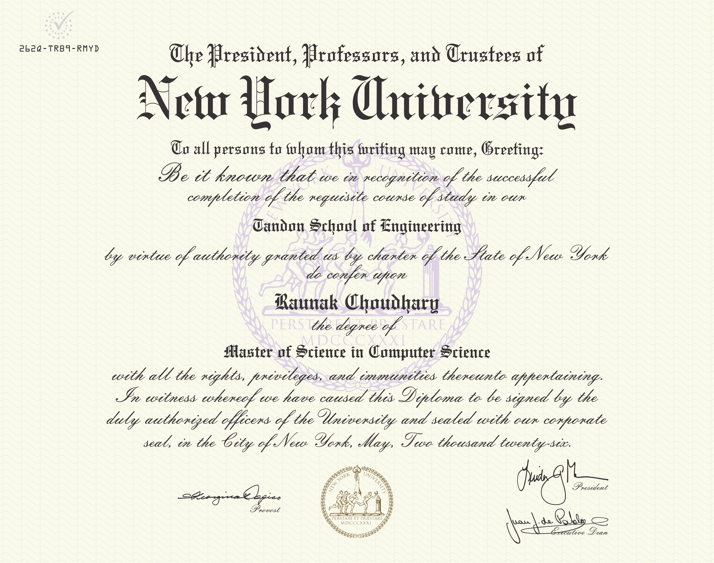
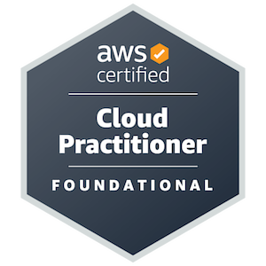
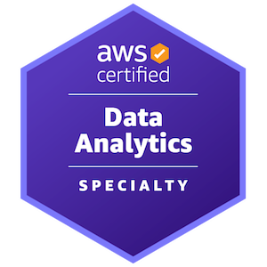
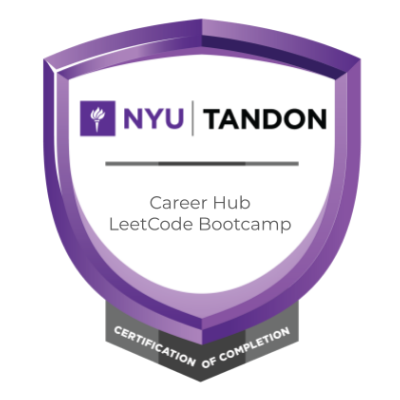
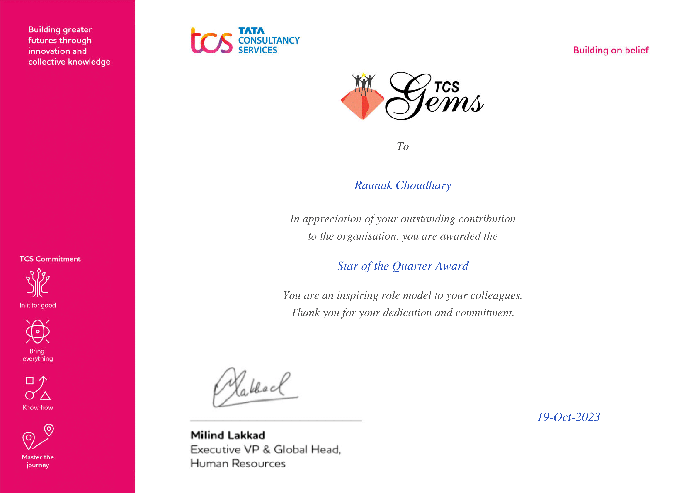
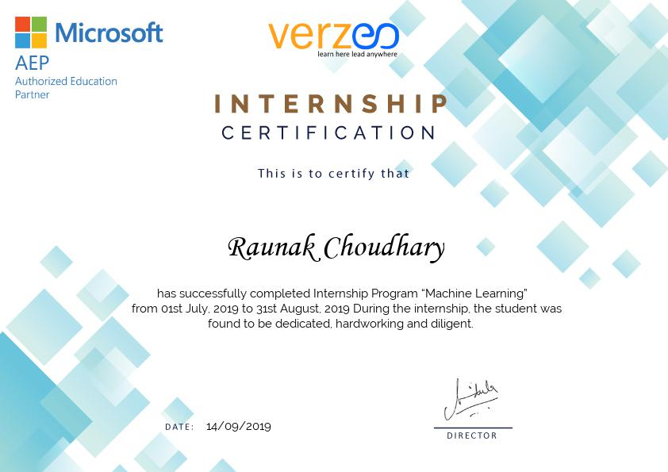
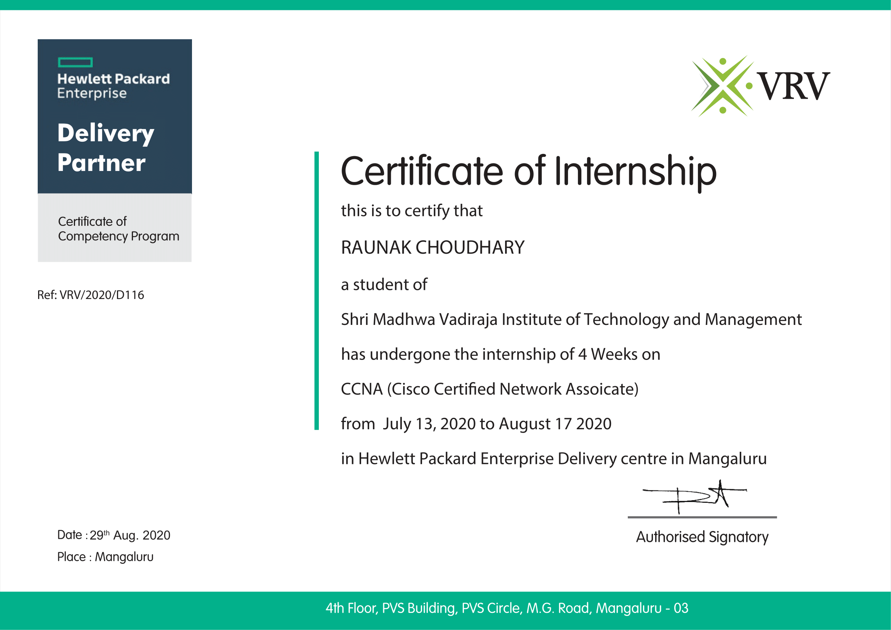
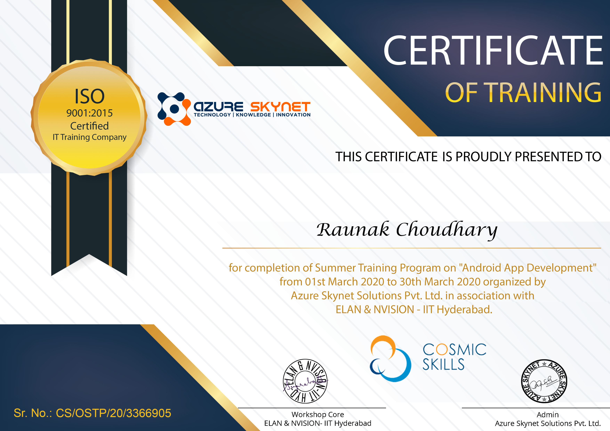
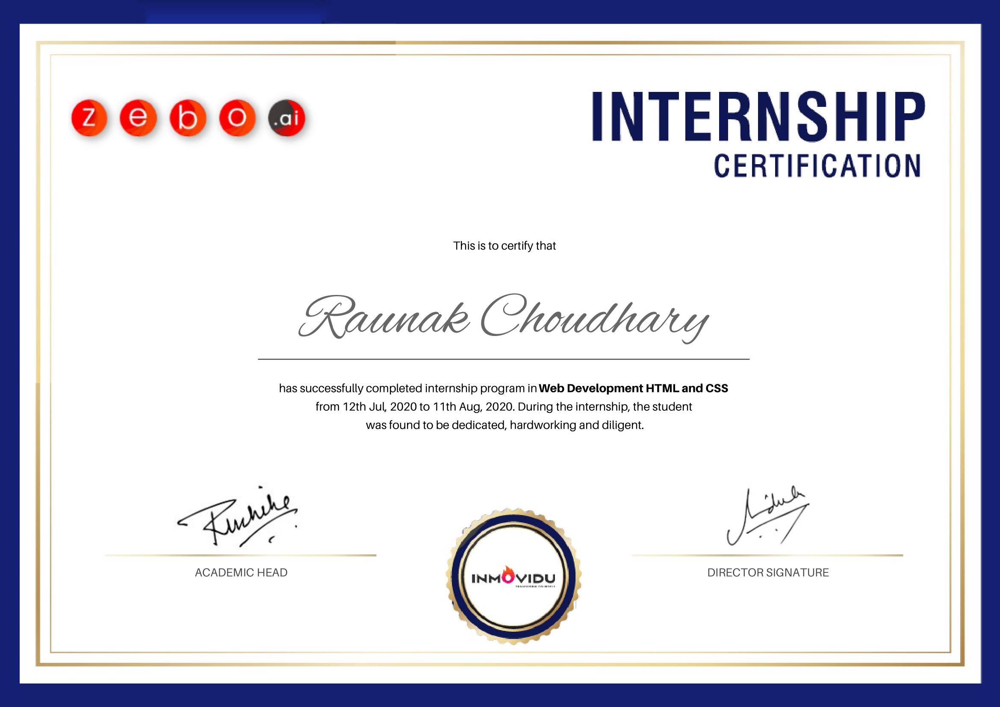
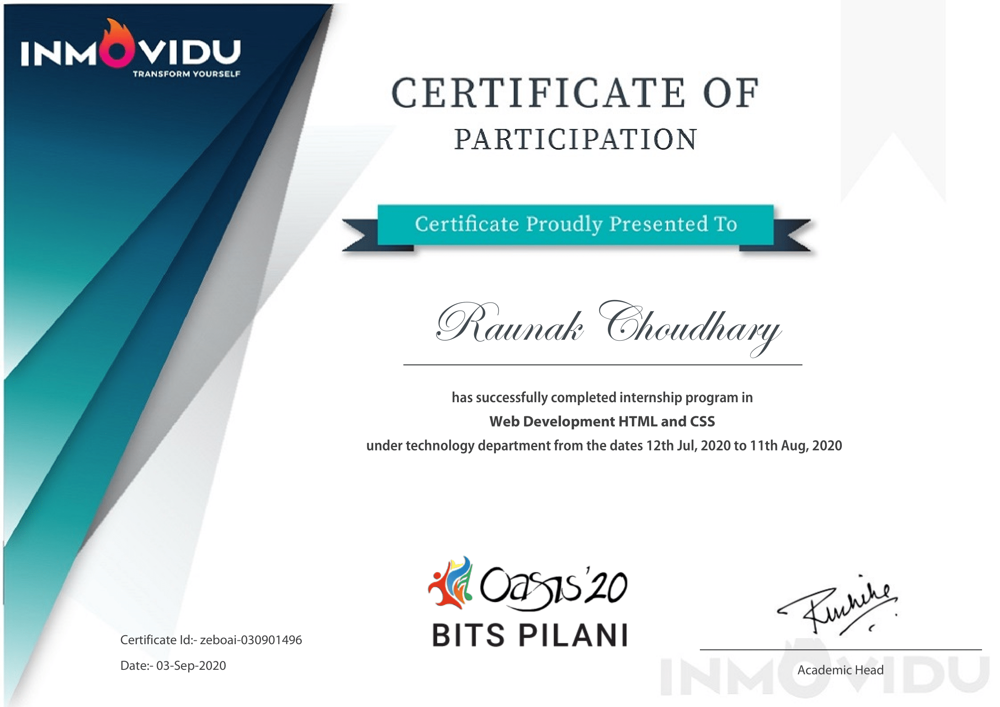

<div align="center">

# Hi, I'm Raunak Choudhary

<a href="https://github.com/raunak-choudhary">
  
</a>

### Open to Software Engineer, AI/ML, Full Stack, and Cloud & DevOps roles

<p>
  <a href="https://www.linkedin.com/in/raunak-choudhary"></a>
  <a href="mailto:raunakchoudhary17@gmail.com"></a>
  <a href="mailto:raunak.choudhary@nyu.edu"></a>
  <a href="https://raunakchoudhary.com/"></a>
  <a href="https://github.com/raunak-choudhary"></a>
</p>

<!-- Contribution snake, refreshed daily by GitHub Actions -->
<picture>
  <source media="(prefers-color-scheme: dark)" srcset="https://raw.githubusercontent.com/raunak-choudhary/raunak-choudhary/output/github-contribution-grid-snake-dark.svg" />
  <source media="(prefers-color-scheme: light)" srcset="https://raw.githubusercontent.com/raunak-choudhary/raunak-choudhary/output/github-contribution-grid-snake.svg" />
  
</picture>

</div>

---

## About Me

```javascript
const raunak = {
  location: "New York, NY, USA",
  education: {
    masters: "M.S. Computer Science, NYU Tandon (GPA 3.9/4.0, May 2026)",
    bachelors: "B.E. Computer Science, VTU (GPA 8.47/10.0, Aug 2021)"
  },
  experience: "3 years at TCS: Software Engineer -> Lead Software Engineer",
  certifications: ["AWS Certified Cloud Practitioner", "AWS Certified Data Analytics - Specialty"],
  domains: ["Software Engineering", "AI / ML", "Full Stack", "Cloud & DevOps"],
  usWorkAuthorization: "Currently on F-1 OPT, authorized to work in the US",
  openTo: "Software Engineer, AI/ML, Full Stack, and Cloud & DevOps roles"
};
```

I build production backend systems and AI applications. My 3 years at TCS spanned ServiceNow integrations, high-throughput Python microservices, and AWS migrations, first as a Software Engineer and then leading an 8-engineer migration team. My recent work covers LLM and agent systems, distributed pipelines, and full-stack products.

---

## Education

| | |
|---|---|
|  | **M.S. in Computer Science**<br/>New York University, Tandon School of Engineering<br/>GPA: 3.9/4.0 &bull; Sept 2024 - May 2026<br/>*Coursework: Design and Analysis of Algorithms, Machine Learning, Deep Learning, Artificial Intelligence, Software Engineering, Information Visualization* |
|  | **B.E. in Computer Science and Engineering**<br/>Visvesvaraya Technological University (SMVITM)<br/>GPA: 8.47/10.0 &bull; Aug 2017 - Aug 2021<br/>*Coursework: Data Structures, Advanced Java and J2EE, Web Technologies, Operating Systems* |

---

## Skills

**Languages**


**AI, ML & NLP**


**Full Stack**


**Cloud & DevOps**


**Data & Databases**


**Platforms**


---

## Professional Experience

<details open>
<summary><b>Click to expand / collapse</b></summary>

<br/>

### Teaching Assistant &bull; New York University (Tandon & Stern)
`Sept 2025 - May 2026` &bull; New York, NY

- Mentored 500+ graduate students across 3 courses and 5 sections in Machine Learning, Applied AI, and Information Security and Privacy.
- Ran hands-on labs in PyTorch and Hugging Face, held office hours, and graded exams and assignments.

### Lead Software Engineer &bull; Tata Consultancy Services
`Sept 2023 - Jul 2024` &bull; Bangalore, India

- Led an 8-engineer cloud team through end-to-end migration of 35+ enterprise applications from on-premises to AWS, covering architecture, provisioning, database migration, deployment, cutover, and production stabilization.
- Owned cloud architecture for backbone, middleware, and data-processing workloads, designing AWS compute, networking, database, security, monitoring, and traffic-management infrastructure for production.
- Directed homogeneous and heterogeneous database migrations across the 35+ applications, including SQL-to-SQL and Oracle-to-PostgreSQL, coordinating replication, validation, cutover, rollback planning, and stabilization.
- Standardized infrastructure delivery with Terraform, CloudFormation, Git, and CI/CD, enabling repeatable provisioning and controlled releases while cutting configuration drift and manual changes.
- Designed and reviewed AWS architectures spanning VPC networking, IAM, security groups, load balancing, Auto Scaling, RDS, monitoring, backups, and disaster recovery, guiding engineers to production readiness.
- Coordinated migration planning and production cutovers across application, database, cloud, and operations teams, owning dependencies, risk mitigation, troubleshooting, and post-launch support.

### Software Engineer &bull; Tata Consultancy Services
`Aug 2021 - Aug 2023` &bull; Bangalore, India

**ServiceNow Platform**
- Built 12 REST API integrations between ServiceNow and enterprise systems, processing 180K+ daily transactions with JavaScript, OAuth 2.0, JSON, and asynchronous execution.
- Engineered server-side logic with JavaScript, GlideRecord, Script Includes, and Business Rules to process 2.4M+ monthly records across enterprise IT workflows.
- Optimized queries and asynchronous processing across 8 high-volume workflows, cutting execution latency from 4.6s to 1.3s for requests serving 25K+ users.

**Python Backend**
- Developed 8 Python microservices and 30+ REST APIs on FastAPI and PostgreSQL, supporting 250K+ daily requests across customer-facing and internal workflows.
- Designed asynchronous pipelines with Python, Kafka, and Redis to process 2.8M+ events per day across 10 consumer workflows, implementing retries, idempotency, and dead-letter handling.

**AWS Migration**
- Provisioned AWS infrastructure for enterprise migrations with Terraform and CloudFormation, standing up compute, networking, databases, load balancing, monitoring, and security.
- Executed homogeneous and heterogeneous database migrations from on-premises SQL and Oracle to Amazon RDS (SQL Server and PostgreSQL), handling replication, validation, cutover, and stabilization.
- Migrated and stabilized business-critical multi-tier applications to AWS, owning provisioning, server configuration, installation, connectivity validation, monitoring, and go-live support.
- Designed cloud infrastructure with EC2, RDS, VPC, IAM, ALB, Auto Scaling, S3, CloudWatch, DMS, and Route 53 for availability, traffic distribution, security, and monitoring.
- Automated repeatable deployments through Infrastructure as Code and reusable Terraform and CloudFormation modules, reducing manual configuration across migration environments.

</details>

---

## Featured Projects

**CascadeOS** - Multi-Agent Infrastructure Failure Predictor ([Repo](https://github.com/raunak-choudhary/cascadeos)) <br/>
Multi-agent urban intelligence system for NYC that predicts cascading infrastructure failures across a 40-node NetworkX graph, with real-time streaming and geospatial visualization. First place at the Code4City Hackathon (NYU Tandon), built solo in 8 hours against 42 teams. <br/>
Skills: `FastAPI` `React (Vite)` `WebSockets` `NetworkX` `LangGraph` `YOLOv8` `deck.gl` `Mapbox`

**Knaq** - Multi-Tenant IoT Alert-Triage Platform ([Repo](https://github.com/raunak-choudhary/knaq-iot-triage)) <br/>
Production-grade IoT triage platform. Ingestion pipeline reads 816 sensor messages with validation, deduplication, and statistical anomaly detection, plus a full triage workflow with audit trail and an analytics dashboard. <br/>
Skills: `SQLAlchemy` `Alembic` `Pydantic` `Next.js` `TypeScript` `MUI` `Redux Toolkit` `ECharts` `Docker`

**Social Pulse** - Real-Time Distributed NLP Pipeline ([Repo](https://github.com/raunak-choudhary/SocialPulse)) <br/>
Streams the Bluesky Jetstream firehose through Kafka into MongoDB across 9 enrichment stages: language detection, sentiment, NER, topic modeling, anomaly detection, zero-shot rumor detection, toxicity, and summarization. <br/>
Skills: `Kafka` `MongoDB` `IsolationForest` `NMF` `Metabase` `Docker Compose`

**Redline Reveal** - Voice-Powered Civic Data Tool ([Repo](https://github.com/raunak-choudhary/redline-reveal-gdg-hackathon-2026)) <br/>
Voice-driven tool over federal CFPB HMDA mortgage data, rendering a choropleth across 262 NYC ZIP codes. Built at the GDG NYC Hackathon 2026. <br/>
Skills: `Google ADK (A2A agents)` `Gemini` `FastMCP` `Cloud Run` `BigQuery` `Web Speech API` `Google Maps JS`

**Adversarial Attacks on ResNet and DenseNet** - Deep Learning Robustness ([Repo](https://github.com/raunak-choudhary/DeepModel-AdversarialAttacks-ResNet-DenseNet)) <br/>
Evaluated FGSM, PGD, MI-FGSM, and patch attacks against pre-trained ResNet-34 and DenseNet-121 on an ImageNet subset, driving ResNet-34 accuracy from 77.40% to 0.00% under PGD, and analyzed cross-architecture transferability. <br/>
Skills: `PyTorch` `TorchVision` `Matplotlib` `Pillow` `Jupyter`

**RoBERTa-LoRA News Classification** - Parameter-Efficient Fine-Tuning ([Repo](https://github.com/raunak-choudhary/RoBERTa-LoRA-News-Classification)) <br/>
Fine-tuned RoBERTa on AG News with LoRA, reaching 94.59% test accuracy while training only 925,444 parameters, about 0.737% of the model. <br/>
Skills: `Hugging Face Transformers` `PEFT` `LoRA` `AG News`

---

## Achievements & Awards

- **1st Place, Code4City Hackathon (NYU Tandon), Apr 2026** - Built CascadeOS solo against 42 teams.
- **Star of the Quarter, TCS (Q3 2023)** - Recognized for contributions to a critical enterprise project.
- **1st Place, I2CONECCT-2021 Project Competition** - TapShip, an agricultural e-marketplace platform.
- **2nd Place, IIoT Exhibition 2019** - Smart Energy Meter, an IoT energy-monitoring system.

---

## Certifications

<div align="center">
  <br>
  <b>Master of Science in Computer Science - New York University</b>
</div>

<h3 align="center">AWS Certifications</h3>
<div align="center">
  <table>
    <tr>
      <td align="center">
        <br>
        <b>AWS Certified Cloud Practitioner</b>
      </td>
      <td align="center">
        <br>
        <b>AWS Certified Data Analytics Specialty</b>
      </td>
    </tr>
    <tr>
      <td align="center">
        <a href="./assets/certifications/aws-cloud-practitioner-certification.png">
          
        </a>
      </td>
      <td align="center">
        <a href="./assets/certifications/aws-data-analytics-certification.png">
          
        </a>
      </td>
    </tr>
  </table>
</div>

<h3 align="center">Microsoft Technology Associate (MTA) Certifications</h3>
<div align="center">
  <table>
    <tr>
      <td align="center">
        <br>
        <b>MTA: HTML5 Application Development Fundamentals</b>
      </td>
      <td align="center">
        <br>
        <b>MTA: Networking Fundamentals (98-366)</b>
      </td>
      <td align="center">
        <br>
        <b>MTA: Python Programming (98-381)</b>
      </td>
    </tr>
    <tr>
      <td align="center">
        <a href="./assets/certifications/MTA_98-375.jpg">
          
        </a>
      </td>
      <td align="center">
        <a href="./assets/certifications/MTA_98-366.jpg">
          
        </a>
      </td>
      <td align="center">
        <a href="./assets/certifications/MTA_98-381.jpg">
          
        </a>
      </td>
    </tr>
  </table>
</div>

<h3 align="center">NYU Tandon LeetCode Bootcamp</h3>
<div align="center">
  <br>
  <b>Competitive Programming & DSA Excellence</b>
</div>

<h3 align="center">Professional Recognition</h3>
<div align="center">
  <table>
    <tr>
      <td align="center">
        <br>
        <b>TCS Star of the Quarter (Q3 2023)</b><br>
        <i>Recognized for contributions to a critical enterprise project.</i>
      </td>
    </tr>
  </table>
</div>

---

## Internships

<details>
<summary><b>Click to expand / collapse</b></summary>

<br/>

**Data Science Intern &bull; Great Learning** - Bangalore, India &bull; `Jun 2020 - Aug 2020`
- Worked on data science and applied statistics projects using Amazon e-commerce, insurance, and LaLiga datasets, running EDA and visualization with Python, NumPy, and Pandas across 1M+ records.
- Applied preprocessing, feature engineering, and visualization methods including violin plots, heatmaps, and network graphs, and presented findings to project mentors.

**Web Development Intern &bull; Inmovidu Technologies** - Virtual &bull; `Jul 2020 - Aug 2020`
- Built 3 responsive web projects with HTML, CSS, JavaScript, and backend integration, implementing REST APIs with database connectivity.
- Worked across frontend and backend layers with a focus on responsive UI. Cleared MTA: HTML5 Application Development Fundamentals (98-375).

**CCNA Networking Intern &bull; Hewlett Packard Enterprise** - Virtual &bull; `Jul 2020 - Aug 2020`
- Designed and simulated 15+ network topologies in Cisco Packet Tracer and studied OSPF, EIGRP, VLANs, and ACLs.
- Covered TCP/IP, subnetting, NAT, and network security configurations. Cleared MTA: Networking Fundamentals (98-366).

**Android App Development Intern &bull; Azure Skynet Solutions** - Virtual &bull; `Mar 2020`
- Built 5 Android applications in Java and Android Studio using Activities, Fragments, Services, and Broadcast Receivers.
- Implemented GPS, camera, and local-storage features and applied Material Design and responsive layouts.

**Machine Learning Intern &bull; Verzeo Edutech** - Bangalore, India &bull; `Jul 2019 - Aug 2019`
- Built an Autism Spectrum Disorder prediction model with K-Nearest Neighbors and Random Forest, and explored NLP for text inputs.
- Collaborated with a 5-intern team to deliver end-to-end ML projects. Cleared MTA: Python Programming (98-381).

<br/>

<h3 align="center">Internship Certificates</h3>
<div align="center">
  <table>
    <tr>
      <td align="center" width="33%">
        <br>
        <b>Machine Learning Internship</b><br>
        <i>Verzeo Edutech Ltd.</i>
      </td>
      <td align="center" width="33%">
        <br>
        <b>Data Science Internship</b><br>
        <i>Great Learning Pvt. Ltd.</i>
      </td>
      <td align="center" width="33%">
        <br>
        <b>CCNA Networking Internship</b><br>
        <i>Hewlett Packard Enterprise</i>
      </td>
    </tr>
    <tr>
      <td align="center">
        <br>
        <b>Android App Development Internship</b><br>
        <i>Azure Skynet Solutions Pvt. Ltd.</i>
      </td>
      <td align="center" colspan="2">
        
        <br>
        <b>Web Development Internship</b><br>
        <i>Inmovidu Technologies</i>
      </td>
    </tr>
  </table>
</div>

</details>

---

## GitHub Stats

<div align="center">

<!-- Stats cards -->


</div>

---

<div align="center">

### Let's Connect

<a href="https://www.linkedin.com/in/raunak-choudhary"></a>
<a href="mailto:raunakchoudhary17@gmail.com"></a>
<a href="mailto:raunak.choudhary@nyu.edu"></a>
<a href="https://raunakchoudhary.com/"></a>

<br/><br/>


</div>
